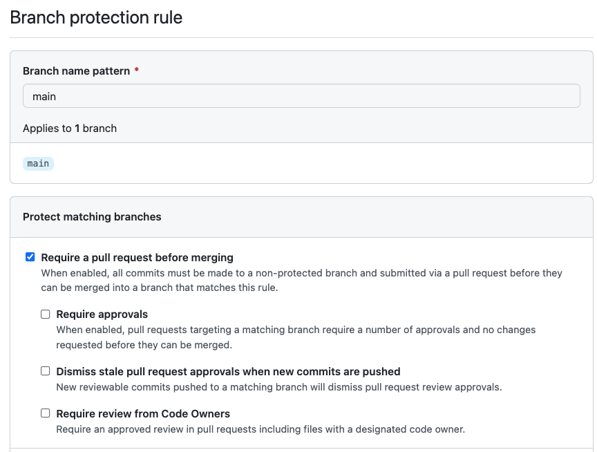
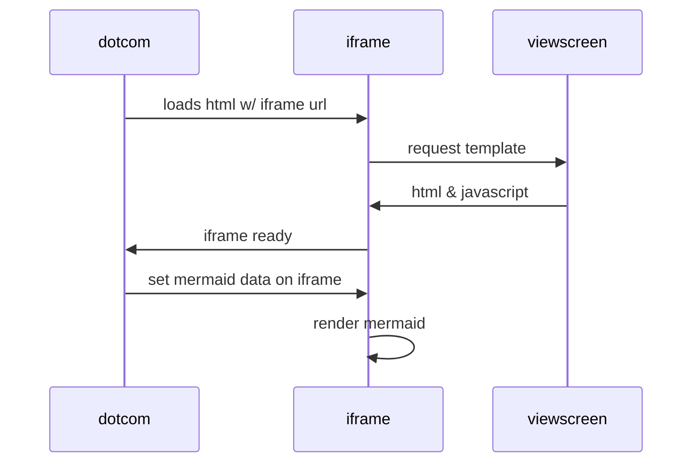

# TDDの練習としてFizzBuzz問題をTypescriptでやってみる

参考にしたサイト：https://typescript-jp.gitbook.io/deep-dive/intro-1/jest

---

# ついでにリリースノート自動作成やテスト実行などのCI/CDをGitHub Actionsでサンプル実装しています

## CI/CDの説明

以下の処理を実装しています

- テスト実行
- リリースノート自動作成

### テスト実行

mainブランチへのプルリク実行時に起動する。
`npm test`を実行する。

`.github/workflows/ci.yml`  : テスト実行のワークフロー定義

### リリースノート自動作成

- release-drafterというGitHub Actionを使用している
  - デフォルトで、`.github/release-drafter.yml`というファイルを設定ファイルとして読み込んで動作します

`.github/workflows/release-notes.yml`  ：リリースノート生成のワークフロー定義
`.github/release-drafter.yml` ：リリースノート内容の定義ファイル

---

## リポジトリの設定

デフォルトブランチはmainブランチにしています。

リリースノート自動生成機能を評価中のため、mainブランチの保護を解除し、push可能にしています。

---
 
リリースノート自動作成を`release-drafter`とは別の方法で実施・評価中です。

* https://zenn.dev/dzeyelid/articles/77541fe1336951?utm_source=pocket_mylist

概要説明

* `.workflows`の`bump-version.yml`と`create-release.yml`を使用
* bump-versionをブラウザから手動起動すると、`major/minor/patch`のどのバージョンアップかを選択すると、bump-version内でバージョンを採番し、tagをpushする。
* tagのpushをトリガーに`create-release`フローが動く。
* `create-release`でリリース作業（≒デプロイ）の実施後、GitHub releaseを作成する
* GitHub release時は、`generate_release_notes`を使用するので、PullRequestにラベルを付けておく必要がある

## Markdownのサンプル

### Mermaid

Mermaid記法を使って、ダイアグラムを埋め込むことができます。  

### Math

数式を埋め込むことができます。  

$記号をデリミタとして使用します。:  `$\sqrt{3x-1}+(1+x)^2$`
→ $\sqrt{3x-1}+(1+x)^2$

**The Cauchy-Schwarz Inequality**

$$\left( \sum_{k=1}^n a_k b_k \right)^2 \leq \left( \sum_{k=1}^n a_k^2 \right) \left( \sum_{k=1}^n b_k^2 \right)$$

